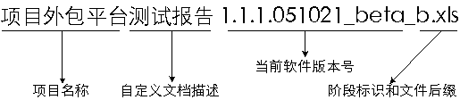
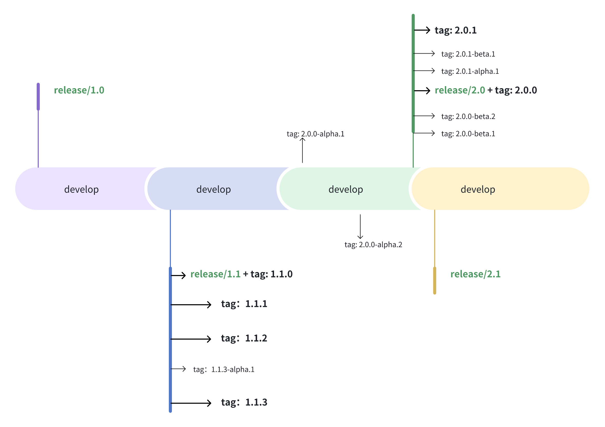

# 版本号和分支管理

## 软件版本阶段说明

- Base版: 此版本表示该软件仅仅是一个假页面链接，通常包括所有的功能和页面布局，但是页面中的功能都没有做完整的实现，只是做为整体网站的一个基础架构。
- Alpha版: 此版本表示该软件在此阶段主要是以实现软件功能为主，通常只在软件开发者内部交流，一般而言，该版本软件的Bug较多，需要继续修改。
- Beta版: 该版本相对于α版已有了很大的改进，消除了严重的错误，但还是存在着一些缺陷，需要经过多次测试来进一步消除，此版本主要的修改对像是软件的UI。
- RC版: （Release   Candidate）该版本已经相当成熟了，基本上不存在导致错误的BUG，与即将发行的正式版相差无几。
- Release版: 该版本意味“最终版本”，在前面版本的一系列测试版之后，终归会有一个正式版本，是最终交付用户使用的一个版本。该版本有时也称为标准版。一般情况下，Release不会以单词形式出现在软件封面上，取而代之的是符号(Ｒ)。


## 版本命名规范


### 版本号定修改规则：

- 主版本号(1)：当功能模块有较大的变动，比如增加多个模块或者整体架构发生变化。此版本号由项目决定是否修改。
- 子版本号(1)：当功能有一定的增加或变化，比如增加了对权限控制、增加自定义视图等功能。此版本号由项目决定是否修改。
- 阶段版本号(1)：一般是 Bug 修复或是一些小的变动，要经常发布修订版，时间间隔不限，修复一个严重的bug即可发布一个修订版。此版本号由项目经理决定是否修改。
- 日期版本号(051021):用于记录修改项目的当前日期，每天对项目的修改都需要更改日期版本号。此版本号由开发人员决定是否修改。
- 希腊字母版本号(beta):此版本号用于标注当前版本的软件处于哪个开发阶段，当软件进入到另一个阶段时需要修改此版本号。此版本号由项目决定是否修改。

也可以不要日期版本号， 简化版本号的规则

> 顺带说下文件命名规则：



## 分支管理

git分支分为集成分支，功能分支、和修复分支。分别命名为develop，feature和hotfix，均为单数。不可使用features、future、hotfixes、hotfixs 等错误名称。

- master（主分支，永远是可用的稳定版本，不能直接在该分支上开发）
- develop（开发主分支，所有新功能以这个分支来创建自己的开发分支，该分支只做合并操作，不能直接在该分支上进行开发）
- feature/*分支（功能开发分支，在develop分支上创建）
- hotfix/*分支（紧急bug修改分支，在master分支上创建，修复完成后合并到master）
- bugfix/*分支 （短期从develop创建）
- release/*分支（短期从develop创建）
  
> 注意事项：
一个分支尽量开发一个功能模块。不要多个功能模块在一个分支上开发
feature分支在申请合并之前，最好是先pull一下主分支develop，看一下有没有冲突，如果有，先解决冲突后再申请合并

## 分支和标签简化规则

如果不是通过 feature/hotfix 等分支 merge 的方式提交代码， 而是类似 github fork 后，提 pr 的方式提交代码， 可以简化分支与标签的规则

### 简化分支
 - develop: 主分支， 用于最新的功能开发， 有分支保护， 必须提 pr， review 后才能由 maintainer 合入
 - release/`^\d+\.\d+$`: 发布分支，用于发布新版本， 如: release/1.2, release/2.0 等等， 有分支保护， 必须提 pr， review 后才能由 maintainer 合入
 - custom/[customer_name]: 客户分支，用于客户开发，如：custom/alibaba, custom/tencent 等等, 一般是从 release 分支切出来的 

  > 注意：无需创建 fix 分支 和 release/`^\d+\.\d+\.\d+$`,  
  因为 fix 版本和 release/1.2.x 版本都是在 release/1.2 上进行的， 
  所以无需创建， 只需要在对应 commit 上有标签即可

### 简化标签
 - `^\d+\.\d+\.\d+(-(alpha|beta|rc)(\.\d+)?)?$`: 版本标签， 如：1.2.3, 1.2.3-alpha.1, 1.2.3-beta.2, 1.2.3-rc.3 等等
 - RC 版本只有在发布像 2.0.0 3.0.0 这样的主版本的时候，才会创建， 如： 2.0.0-rc.1 3.0.0-rc.1 等等
 - 主版本号只有在像架构变化等场景(强不兼容)才会更新， 如： 1.x -> 2.x 应该是完全不兼容的
 - 子版本号只有在新增功能(较大功能)的时候才会更新， 如： 1.1 -> 1.2
 - 阶段版本号(fix 版本)一般只是做 bugfix、新增小功能 等工作时做更新， 如： 1.1.1 -> 1.1.2



图示说明
1. 只有发布 x.x.0-beta.1 的时候， 才会从 develop 创建 release/x.x 的分支；
2. 在发布 x.x.0-beta.1 之前的 tag: x.x.0-alpha.x 都在 develop 分支上进行, 所以 develop 分支上会有很多的 x.x.0-alpha.x 的标签;
3. 但在发布 x.x.0-beta.1 之后的 tag: x.x.0-beta.x 都在 release/x.x 分支上进行， 所以 release/x.x 分支上会有很多的 x.x.0-beta.x 的标签;
4. 阶段版本号或者称 bugfix 版本号的标签， 如： x.x.[1-9] 和 x.x.[1-9]-[alpha|beta].x 都在 release/x.x 分支上进行， 所以 release/x.x 分支上会有很多的 x.x.[1-9] 和 x.x.[1-9]-[alpha|beta].x 的标签;


## 工作流程
1. git clone 仓库, 仓库路径应使用源仓库， fork 源仓库
2. git remote add fork [fork-repository-rul]
3. git checkout 切到对应分支开发
4. git add . 添加修改的文件
5. git commit -m "提交信息"
6. git push fork 分支名称
7. 在 fork 仓库中提交 pull request
8. 在 pull request 中说明功能和 issue-id 号
9. 确定 pr 通过 action 后， 合并到 develop 分支
10. 如有必要， 也往其它 release 分支提交 pr


## 最佳实践

### git 提交记录模板
```md
# <type>: (If applied, this commit will...) <subject> (Max 50 char)
# |<----  Using a Maximum Of 50 Characters  ---->|


# Explain why this change is being made
# |<----   Try To Limit Each Line to a Maximum Of 72 Characters   ---->|

# Provide links or keys to any relevant tickets, articles or other resources
# Example: Github issue #23

# --- COMMIT END ---
# Type can be 
#    feat     (new feature)
#    fix      (bug fix)
#    refactor (refactoring production code)
#    style    (formatting, missing semi colons, etc; no code change)
#    docs     (changes to documentation)
#    test     (adding or refactoring tests; no production code change)
#    chore    (updating grunt tasks etc; no production code change)
# --------------------
# Remember to
#   - Capitalize the subject line
#   - Use the imperative mood in the subject line
#   - Do not end the subject line with a period
#   - Separate subject from body with a blank line
#   - Use the body to explain what and why vs. how
#   - Can use multiple lines with "-" for bullet points in body
# --------------------
```


### PR 模板

在 repo 里创建 pr 模板， 减少 review 的时间， 模板位置在： `.github/pull_request_template.md`

*例如* 

```md
## Jira Link:
- 

## Enhancements
- 

## Bug Fixes
-

## Breaking Changes
-
```

